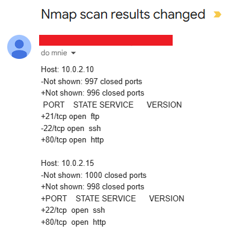

## WHAT IT IS?
This script allows for monitoring open network ports with a feature that compares them against a reference set. The system is designed in the style of the popular XML comparison tool — ndiff — but has been enhanced with an additional functionality: a notification system. \
The script enables monitoring of any number of hosts located within the same subnet. It operates by comparing two XML files — a reference file and a current one — both generated from scans performed using the nmap tool. \
The user can configure time intervals at which they will receive email notifications about any detected changes in port states. 

## HOW TO USE IT?
1. Download the script to your machine and open it in any text editor (e.g., nano). Then fill in the global variables located at the top of the file:
   ```
   SMPT_EMAIL = ''      # email address from which the scan comparison result is sent
   SMPT_PASSWORD = ''   # temporary app password generated in Gmail 
   ADMIN_EMAIL = ''     # email address to which the scan comparison result is sent
   ```
   A guide showing how to enable two-step verification will be helpful for generating [the temporary app password](https://support.google.com/accounts/answer/185839?hl=pl&co=GENIE.Platform%3DDesktop).
3. Fill in the IP addresses (line 15) of the hosts you want to scan (they must be in the same subnet). Save the changes and close the file.
4. Run the initial (reference.xml) scan using the terminal with the command:
   ```
   $ nmap -oX reference.xml <IP_address_1> <IP_address_2> ...
   ```
   The addresses must match the ones provided in the script. \
   Additionally, the files main.py and reference.xml should be located in the same directory on your machine (e.g., on the desktop).
6. Open the Cron tool to set time intervals for receiving notifications by running the command:
   ```
   $ crontab -e
   ```   
   A very helpful resource for this task is that [link](https://crontab.guru/).

## EXAMPLE USAGE
To demonstrate how the script works, two virtual machines with Kali Linux installed were created and placed in the same NAT network with the address 10.0.2.0/24:
* machine # 1 - 10.0.2.10
* machine # 2 - 10.0.2.15 

The script was downloaded to machine #1, the required global variables and line 15 of the main.py file were filled in. Then, SSH (port 22) and SAMBA (ports 139 and 445) services were started, and a reference scan was performed:
* example line 15:
  <p align="left">
    
  </p>
* reference scan:
  ```
  $ nmap -oX reference.xml 10.0.2.10 10.0.2.15
  ```
Next, an appropriate time interval was set using Cron:
  <p align="left">
    
  </p>
After that, on machine #1, the SSH service (port 22) was shut down and FTP (port 21) and HTTP (port 80) services were started. On machine #2, SSH (port 22) and HTTP (port 80) services were started. 

Email output received:  
<p align="left">
  
</p>

